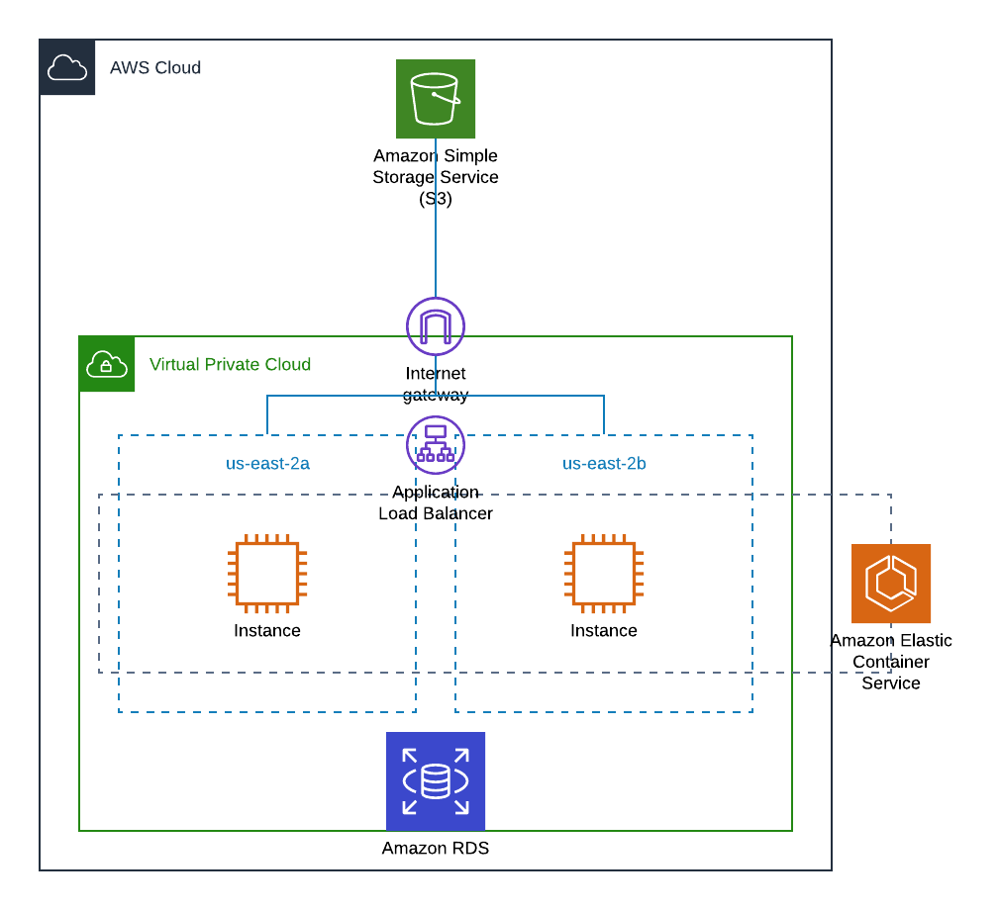

# RampUp 2020: Pizza application

Pizza application in React and deploy in AWS S3 Bucket.

## Architecture

Only for the application frontend, a S3 bucket will be deploy it. The application backend is located [here](https://github.com/mnl359/pizzas-back/tree/master)

## Software requirements

To run this application without CI/CD tool, the software needed is:

- NPM
- terraform

## Deploy

First, you need to create a S3 bucket and a DynamoDB table to store the terraform state. Also, change the following variables in the [state_config.tf](terraform/state-config.tf):

| Line | Variable | Description |
| ---- | -------- | ----------- |
| 3    | bucket   | Your bucket name |
| 4    | key      | Path to the state file in the bucket |
| 6    | dynamodb_table | Table to store the terraform Lock |

### Manual

1. Change the projects [variables](terraform/variables.tf)

| Line | Variable | Description |
| ---- | -------- | ----------- |
| 1    | profile  | AWS profile to execute the terraform |
| 14   | tags     | Adjust the tags for your needs |
| 24   | IP_VPC   | VPC IP for the application |
| 30   | IP_paSUB1| IP for subnet |
| 42   | IP_paSUB2| IP for subnet |
| 68   | asg_max-instances | Maximum running instances in group|

### Pipeline